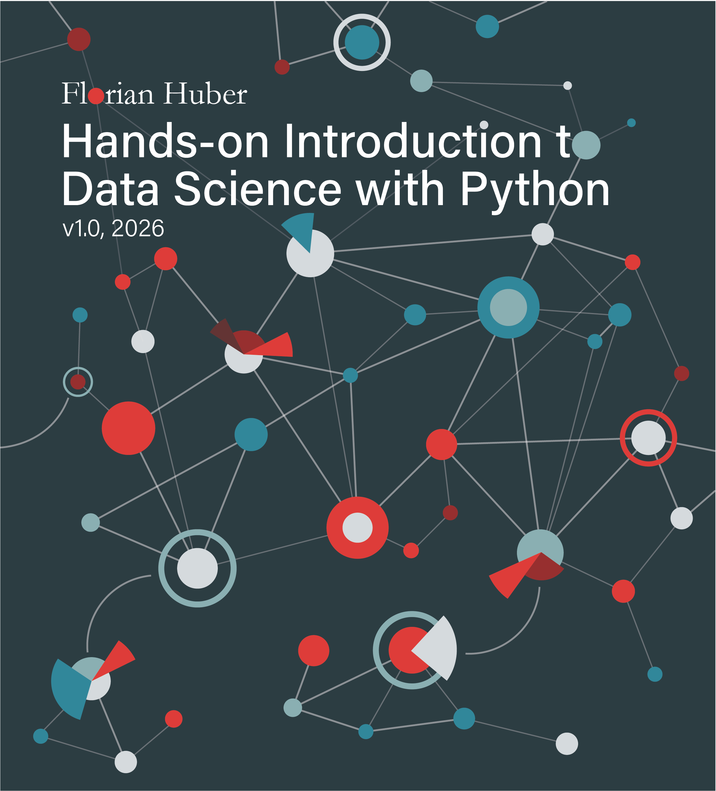

# Hands-on Introduction to Data Science with Python

**by Florian Huber**

Düsseldorf University of Applied Sciences (HSD)  
& Centre for Digitalization and Digitality (ZDD)

**v0.25** 2026-04-01

**About me:**
I work as a professor for Data Science and Visual Analytics at the [Düsseldorf University of Applied Sciences](https://www.hs-duesseldorf.de/). This is also where I teach students the basics of data science, Python programming, machine learning, or where I give unsolicited advice on coffee, chocolate, and all other things that really matter in life.

Until I manage to either find or build a more suitable platform, you can also find me on Bluesky: [https://bsky.app/profile/me-datapoint.bsky.social](https://bsky.app/profile/me-datapoint.bsky.social) and [GitHub](https://github.com/florian-huber).

This book is licensed under the [Creative Commons Attribution-NonCommercial-ShareAlike 4.0 International License](http://creativecommons.org/licenses/by-nc-sa/4.0/).


```{toctree}
:hidden:
:maxdepth: 1
:caption: Introduction

book/01_intro
book/02_what_is_data_science
book/03_data_science_ethics_society
book/04_use_of_this_book
```

```{toctree}
:hidden:
:maxdepth: 1
:caption: From Data to Knowledge

book/05_data_and_types
book/06_data_acquisition
book/07_data_information_knowledge
book/08_data_science_workflow
```

```{toctree}
:hidden:
:maxdepth: 1
:caption: First Data Exploration

notebooks/09_data_preparation
notebooks/10_distributions_statistical_measures
```

```{toctree}
:hidden:
:maxdepth: 1
:caption: In-depth Data Exploration

notebooks/11_correlation_analysis
notebooks/12_clustering
notebooks/12b_clustering_beyond_the_basics
notebooks/13_introduction_outlier_detection
notebooks/14_dimensionality_reduction
```

```{toctree}
:hidden:
:maxdepth: 1
:caption: Supervised Machine Learning (Basics)

notebooks/15_machine_learning
notebooks/16_machine_learning_algorithms
notebooks/17_machine_learning_algorithms_2
notebooks/18_machine_learning_algorithms_3
notebooks/19_machine_learning_techniques
notebooks/20_machine_learning_ensembles
```

```{toctree}
:hidden:
:maxdepth: 1
:caption: Working with Text Data

notebooks/21_working_with_text_data
notebooks/22_NLP_2_tokenization
notebooks/23_NLP_3_tfifd_and_machine_learning
notebooks/24_NLP_4_ngrams_word_vectors
```

```{toctree}
:hidden:
:maxdepth: 1
:caption: Look at the Networks

notebooks/25_graphs
notebooks/26_graph_visualization
notebooks/27_graphs_communities
```

```{toctree}
:hidden:
:maxdepth: 1
:caption: Next Steps

notebooks/outlook
```

```{toctree}
:hidden:
:maxdepth: 1
:caption: References

book/acknowledgements
book/references
```

```{toctree}
:hidden:
:maxdepth: 1
:caption: Source Code and Contributions

book/github
```