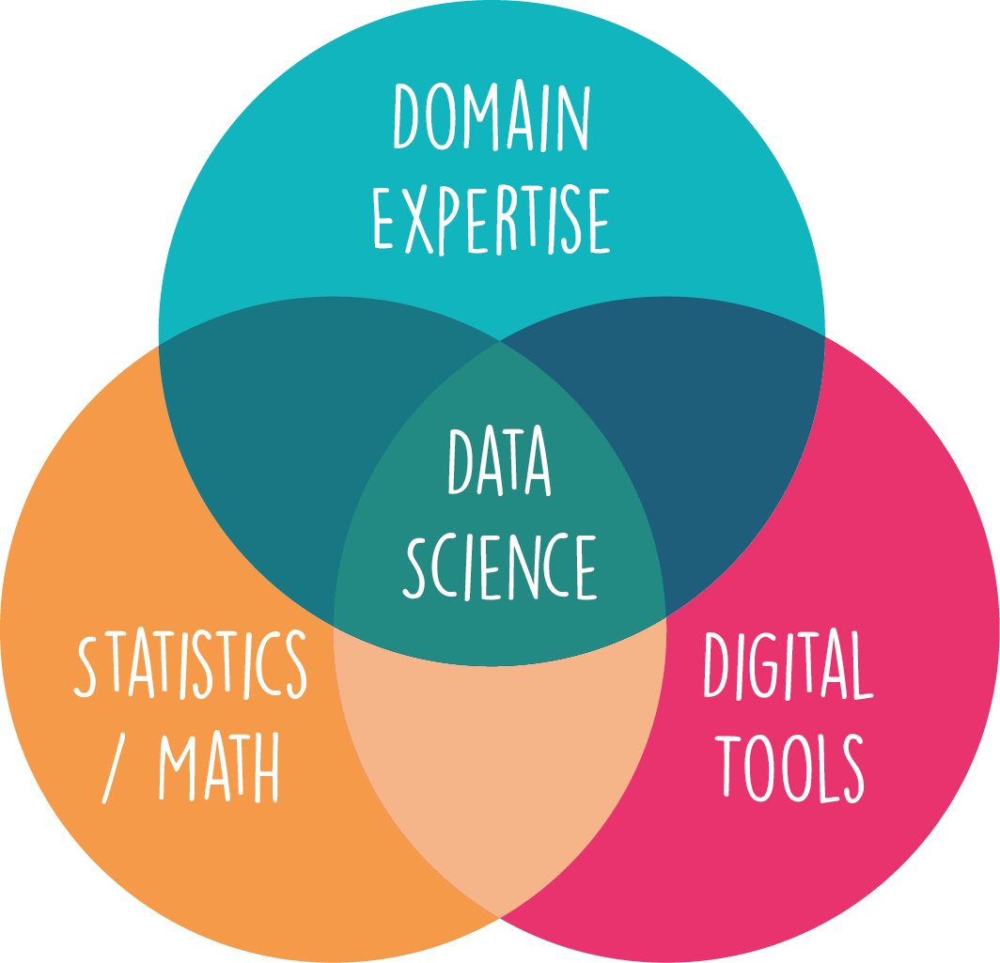

(ch_data_science_intro)=
# What is Data Science?

In short, data science is about extracting, interpreting, and communicating relevant insights from complex data with the help of digital techniques.

Unlike long-established fields such as mathematics, physics, or history, data science is a relatively new term and area of study. If you ask ten data scientists to define their field, you will likely get ten different answers. Some might view it as a distinct discipline, others as a technical  approach or mindset, and still others might consider it synonymous with statistics. Many authors have contributed definitions or descriptions of what data science is {cite}`cao_2017, donoho_2017, blei2017science, carmichael2018data, grus2019data`, but for now let's start with the rather general and accessible description of data science as 
> **the practice of gaining, interpreting, and communicating insights from complex data through digital techniques**.

Many quantitative scientists would argue that they do similar work, as they strive to learn from data and use digital tools extensively. This overlap does not diminish the importance of data science; it simply indicates that many scientists must also be data scientists to stay current in their fields. Rapid advancements in digital techniques, including machine learning, are transforming many research areas.

Opinions on what data science exactly is can vary, often depending on the application area. In consulting and business, data science might mean something different than in academia. However, one especially common way to illustrate data science is with a Venn diagram: the overlap between digital techniques, statistics, and domain expertise {cite}`conway_data_2010, carmichael2018data`.



**Figure 1.** Venn diagram to indicate the intersection of fields for data science.

## Data is Not New. Why Has Data Science Emerged Now?

Data has been a cornerstone of human understanding for millennia - from ancient civilizations keeping records of harvests and astronomy, to modern businesses tracking sales and performance. It's clear that data in itself is not a new concept. However, the emergence and ascendancy of data science as a discipline is a relatively recent phenomenon. So, why now?

The prominence of data science in today's world can be attributed to several concurrent developments:

(1) The exponential **increase in the volume of data generated**. Thanks to digitalization and the rise of the Internet, mobile devices, and IoT (Internet of Things), we are producing data at a previously unimaginable scale. This big data presents both a challenge and an opportunity - the challenge being how to handle and process this vast amount of information, and the opportunity being the valuable insights that can be gleaned from it. 

This is accompanied by an increased recognition of the importance of data-driven decision-making across diverse sectors {cite}`provost2013data`. Various industries, governments, and institutions have realized that leveraging the power of data can lead to increased efficiency, better decision-making, and a competitive advantage. 

This existence (and appreciation) of larger and larger amounts of data can be seen as a substrate for the rise of data science, but it really needed a combination of several other developments to be able to properly work with such data ({numref}`fig_historical_streams`).

(2) The evolution and expansion of **statistical methodologies** have been a key driver. Statistics provide the foundational principles and techniques for analyzing data, making inferences, and predicting future trends. In the era of big data, classical and modern statistical techniques form the backbone of most analyses in data science. The relationship between statistics and data science is so close that some statisticians have argued that data science should be understood as a modern extension or reframing of statistics. In the late 1990s, Jeff Wu famously proposed viewing statistics as "data science", and the relationship between the two fields is still debated today {cite}`carmichael2018data`. Despite all overlap, both terms still exist and usually mean related but different things (see also {cite}`hassani2021science`).

(3) The strides we've made in **data handling capabilities** have greatly facilitated the rise of data science. This obviously includes the drastic advancements in computational power and storage capabilities that made it possible to collect, store, and analyze these massive datasets. But this also includes many developments from computer science, such as databases. Just a few decades ago, collecting, storing, and analyzing the vast amounts of data we deal with today would have been unimaginable, let alone impractical.

(4) There has been significant progress in the field of **algorithms**, which also includes machine learning. Algorithms are central to many tools used in data science, from classical optimization methods and statistical estimation to modern machine learning and deep learning approaches. These advancements have opened up new possibilities for predictive analytics, automation, and artificial intelligence.

(5) Lastly, the increasingly important field of data visualization has greatly expanded the ways in which we can explore, understand, and communicate data. Effective data visualization makes complex data more comprehensible, accessible, and actionable. The development of powerful visualization tools enables us to present data in a visually compelling manner that fosters understanding and drives informed decisions {cite}`munzner2014visualization, healy2018data, wilke2019fundamentals`.

So, while data is not new, the volume of data, our ability to process it, and the recognition of its value, are. These changes have given rise to the burgeoning field of data science, marking a new era in our relationship with data.

```{figure} ../images/figure_foundations_of_data_science_history.png
:name: fig_historical_streams

The concurrent developments leading to Data Science [^bayes_and_gauss].
```

(facets_of_data_science)=
## A brief spotlight: the many facets of Data Science

Data science, by its very nature, stands at the bustling intersection of digital techniques, statistical methodologies, and domain expertise. It is a broad and incredibly diverse field with intricate links to many different sectors and disciplines. This diversity results in a wide variety of roles and responsibilities, each bringing unique skills and viewpoints to address an array of challenges and opportunities.

One of the key characteristics that makes data science so dynamic is its inherent multidisciplinarity. Data science **isn't just about dealing with numbers or coding**, it's about leveraging a suite of digital tools and statistical methods to draw insights from data, and applying these insights to a specific context or domain. A data scientist working in healthcare, for instance, might use different techniques and has a different focus than a data scientist working in retail or finance. The beauty of data science lies in this versatility, it is a field where skills and disciplines converge and collaborate (see {ref}`fig_data_science_landscape`). 

```{figure} ../images/data_science_skills_landscape.png
:name: fig_data_science_landscape

A characteristic feature of data science is the need to combine many different techniques, skills, and perspectives. Obviously, no one can realistically claim to have mastered all the different aspects shown in this figure, and the figure is by no means exhaustive. Many more items could easily be added. In many cases, success is less about mastering everything and more about developing key competencies, learning how to navigate unfamiliar areas, and either acquiring new knowledge when needed or, often even better, finding the right people to help through collaboration, teamwork, and discussion.
```

Given the breadth and depth of the field, being a successful data scientist requires much more than just technical skills. A natural curiosity to explore and understand data, an openness to new ideas and methods, the eagerness to continuously learn and adapt, combined with a critical attitude to question restuls, and most crucially, the ability to communicate and collaborate effectively are all vital attributes. After all, data science is a team sport. **No single person can master all facets of data science**. Instead, it's about bringing diverse skills together, working with others, and learning from each other.

And no worries if all the different angles displayed in {ref}`fig_data_science_landscape` appear overwhelming at first; that is a completely normal reaction. In many cases, the challenge is less about mastering everything and more about learning how to navigate this complex landscape: knowing where you are, where you need to go, and whom to ask for help. I will not try to fool you by saying that this is simple or something that can be achieved in just a few weeks, even if some online materials or courses might suggest otherwise. If it were never difficult, there would be no need for someone like you as a future data scientist. The good news, however, is that many people I have met not only learned a great deal on their journey to becoming data scientists, but also genuinely enjoyed that journey. If you are serious about this, I am quite sure that you, too, will become fascinated by many of the skills and techniques that not only give us new ways of interpreting data, but also often offer a new perspective on how to understand the world around us.

Not surprisingly, not everything shown in the data science landscape sketch will be covered in this book. Some of the things in this sketch probably cannot even be learned from a book. But this book will hopefully help you build a solid foundation from which you can begin to navigate this landscape professionally.


[^bayes_and_gauss]: Images of [Thomas Bayes](https://commons.wikimedia.org/wiki/File:Thomas_Bayes.gif) and [Carl Friedrich Gauß](https://commons.wikimedia.org/wiki/File:Bendixen_-_Carl_Friedrich_Gau%C3%9F,_1828.jpg) taken from Wikipedia. For Thomas Bayes it is not even fully certain that the image actually shows him.
