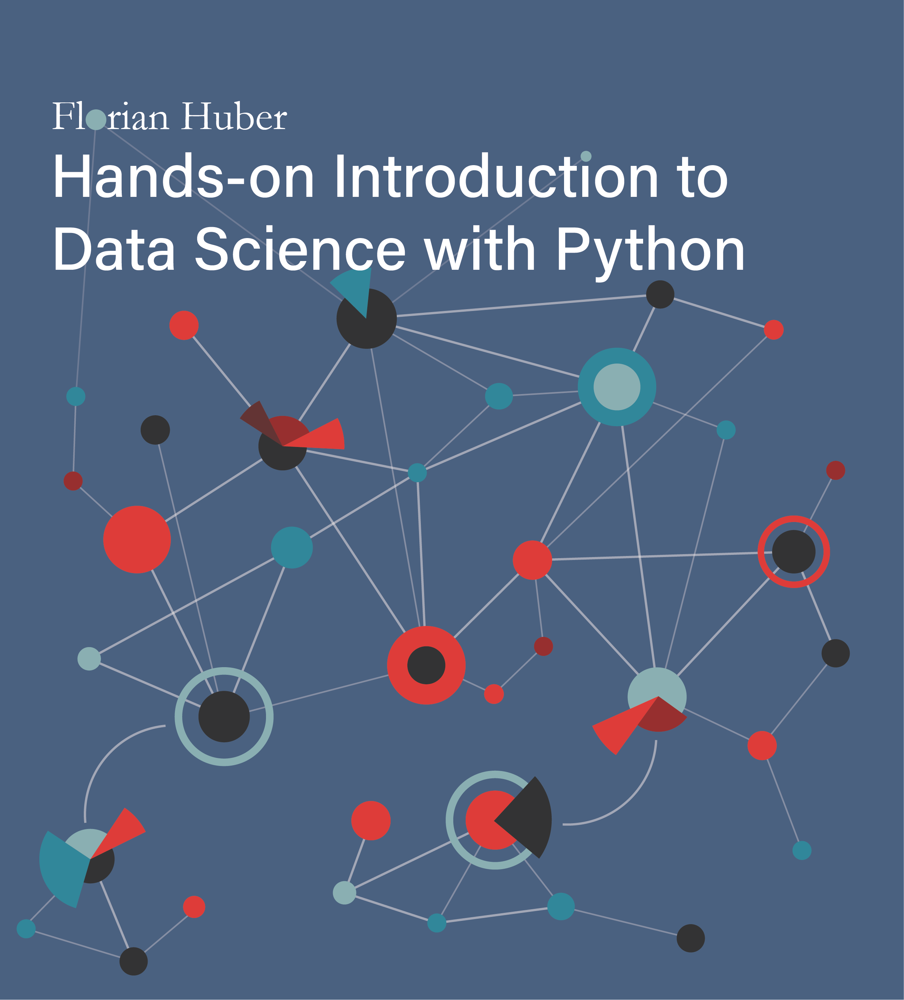

## Introduction to Data Science (for not-yet scientists)

**by Florian Huber**

Düsseldorf University of Applied Sciences (HSD)  
& Centre for Digitalization and Digitality (ZDD)

**v0.13** 2024-05-14

**About me:**
I work as a professor for Data Science and Visual Analytics at the [Düsseldorf University of Applied Sciences](https://www.hs-duesseldorf.de/). This is also where I teach students the basics of data science, Python programming, machine learning, or where I give unsolicited advice on coffee, chocolate, and all other things that really matter in life.

Until I manage to either find or build a more suitable platform, you can also find me on Mastodon: [mastodon.online/@me_datapoint](https://mastodon.online/@me_datapoint) or (less and less likely...) on Twitter/X: [@me_datapoint](https://twitter.com/me_datapoint).

This book is licensed under the [Creative Commons Attribution-NonCommercial-ShareAlike 4.0 International License](http://creativecommons.org/licenses/by-nc-sa/4.0/).